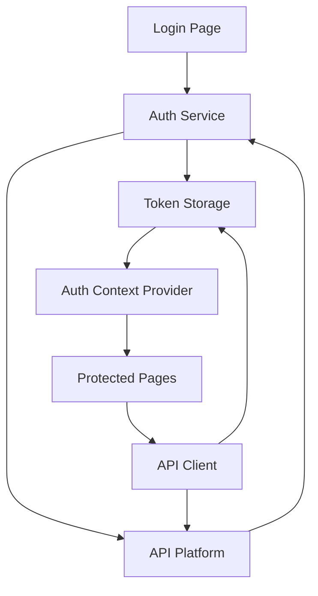
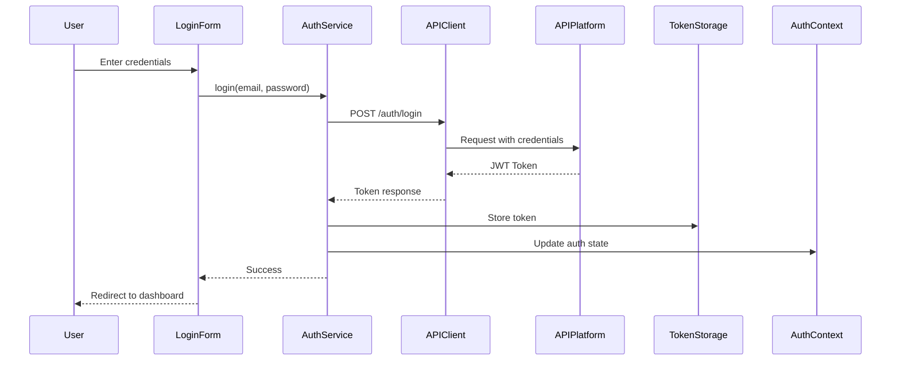

# Design Document

## Overview

This design implements a custom authentication system for the Next.js admin dashboard that replaces the existing Kinde authentication with API Platform-based authentication. The system uses email/password credentials to obtain JWT tokens from the API Platform and manages authenticated sessions using bearer token authentication for all subsequent API requests.

The design follows Next.js 15 App Router patterns with React Server Components where appropriate, and uses client-side state management for authentication context.

## Architecture

### High-Level Architecture



### Authentication Flow



## Components and Interfaces

### 1. Authentication Service (`src/services/auth.service.ts`)

Core service handling all authentication operations.

```typescript
interface LoginCredentials {
  email: string;
  password: string;
}

interface AuthResponse {
  token: string;
  refreshToken?: string;
  user: {
    id: string;
    email: string;
    name: string;
  };
}

interface AuthService {
  login(credentials: LoginCredentials): Promise<AuthResponse>;
  logout(): Promise<void>;
  refreshToken(): Promise<string>;
  getCurrentUser(): Promise<User | null>;
}
```

**Key Responsibilities:**
- Handle login/logout operations
- Communicate with API Platform authentication endpoints
- Coordinate with token storage
- Handle token refresh logic

### 2. API Client (`src/lib/api-client.ts`)

HTTP client wrapper that automatically injects bearer tokens.

```typescript
interface ApiClientConfig {
  baseURL: string;
  timeout?: number;
}

interface ApiClient {
  get<T>(url: string, config?: RequestConfig): Promise<T>;
  post<T>(url: string, data?: any, config?: RequestConfig): Promise<T>;
  put<T>(url: string, data?: any, config?: RequestConfig): Promise<T>;
  delete<T>(url: string, config?: RequestConfig): Promise<T>;
}
```

**Key Features:**
- Automatic bearer token injection from storage
- Request/response interceptors
- Automatic 401 handling and redirect to login
- Error transformation and handling

### 3. Token Storage (`src/lib/token-storage.ts`)

Manages secure storage and retrieval of JWT tokens.

```typescript
interface TokenStorage {
  setToken(token: string): void;
  getToken(): string | null;
  removeToken(): void;
  setRefreshToken(token: string): void;
  getRefreshToken(): string | null;
  removeRefreshToken(): void;
}
```

**Implementation Strategy:**
- Use `localStorage` for token persistence (client-side only)
- Provide server-side compatible methods that return null
- Consider `js-cookie` for cookie-based storage as alternative

### 4. Auth Context Provider (`src/contexts/auth-context.tsx`)

React context providing authentication state and methods throughout the app.

```typescript
interface AuthContextValue {
  user: User | null;
  isAuthenticated: boolean;
  isLoading: boolean;
  login: (credentials: LoginCredentials) => Promise<void>;
  logout: () => Promise<void>;
  refreshAuth: () => Promise<void>;
}
```

**Key Responsibilities:**
- Maintain global authentication state
- Provide authentication methods to components
- Handle initial auth state hydration on app load
- Manage loading states during auth operations

### 5. Login Form Component (`src/components/Auth/SigninWithPassword.tsx`)

Updated form component for email/password authentication.

**Changes from existing:**
- Remove Kinde integration
- Connect to Auth Context
- Add proper error handling and display
- Implement loading states
- Add form validation using Zod

### 6. Protected Route Wrapper (`src/components/Auth/ProtectedRoute.tsx`)

Component/HOC to protect routes requiring authentication.

```typescript
interface ProtectedRouteProps {
  children: React.ReactNode;
  redirectTo?: string;
}
```

**Behavior:**
- Check authentication state from context
- Redirect to login if not authenticated
- Show loading state while checking auth
- Allow access if authenticated

### 7. Auth Middleware (`src/middleware.ts`)

Next.js middleware for server-side route protection.

**Responsibilities:**
- Validate token presence for protected routes
- Redirect unauthenticated requests to login
- Allow public routes (login, signup, etc.)

## Data Models

### User Model

```typescript
interface User {
  id: string;
  email: string;
  name: string;
  role?: string;
  createdAt?: string;
}
```

### Login Form Schema

```typescript
const LoginFormSchema = z.object({
  email: z.string().email({ message: 'Please enter a valid email.' }).trim(),
  password: z.string().min(1, { message: 'Password is required' }).trim(),
});
```

### API Error Response

```typescript
interface ApiError {
  message: string;
  errors?: Record<string, string[]>;
  statusCode: number;
}
```

## Error Handling

### Error Categories

1. **Validation Errors**: Client-side form validation failures
   - Display field-specific errors below inputs
   - Prevent form submission

2. **Authentication Errors**: Invalid credentials (401)
   - Display "Invalid email or password" message
   - Clear password field

3. **Network Errors**: Connection failures, timeouts
   - Display "Unable to connect. Please try again."
   - Provide retry option

4. **Server Errors**: 500-level errors
   - Display "Something went wrong. Please try again later."
   - Log error details for debugging

### Error Handling Strategy

```typescript
// Centralized error handler in API client
function handleApiError(error: any): ApiError {
  if (error.response) {
    // Server responded with error status
    return {
      message: error.response.data.message || 'An error occurred',
      errors: error.response.data.errors,
      statusCode: error.response.status,
    };
  } else if (error.request) {
    // Request made but no response
    return {
      message: 'Unable to connect. Please check your internet connection.',
      statusCode: 0,
    };
  } else {
    // Something else happened
    return {
      message: 'An unexpected error occurred',
      statusCode: 0,
    };
  }
}
```

### 401 Unauthorized Handling

When any API request receives a 401 response:
1. Clear stored tokens
2. Update auth context to unauthenticated state
3. Redirect to login page
4. Preserve intended destination for post-login redirect

## Testing Strategy

### Unit Tests

1. **Auth Service Tests**
   - Test login with valid credentials
   - Test login with invalid credentials
   - Test logout functionality
   - Test token refresh logic

2. **API Client Tests**
   - Test bearer token injection
   - Test 401 response handling
   - Test error transformation

3. **Token Storage Tests**
   - Test token set/get/remove operations
   - Test server-side compatibility

4. **Form Validation Tests**
   - Test email validation
   - Test password validation
   - Test error message display

### Integration Tests

1. **Authentication Flow**
   - Complete login flow from form submission to dashboard redirect
   - Logout flow and session cleanup
   - Protected route access with and without authentication

2. **API Integration**
   - Test actual API Platform endpoints (with test credentials)
   - Test token refresh flow
   - Test concurrent requests with token injection

### Manual Testing Checklist

- [ ] Login with valid credentials redirects to dashboard
- [ ] Login with invalid credentials shows error
- [ ] Session persists across page refresh
- [ ] Logout clears session and redirects to login
- [ ] Protected routes redirect to login when not authenticated
- [ ] API requests include bearer token
- [ ] 401 responses trigger logout and redirect
- [ ] Loading states display correctly
- [ ] Error messages are clear and helpful

## Configuration

### Environment Variables

```env
# API Platform Configuration
NEXT_PUBLIC_API_BASE_URL=http://localhost:3000
NEXT_PUBLIC_API_TIMEOUT=1000

# Authentication Endpoints
NEXT_PUBLIC_AUTH_LOGIN_ENDPOINT=/auth
NEXT_PUBLIC_AUTH_REFRESH_ENDPOINT=/auth/refresh
NEXT_PUBLIC_AUTH_USER_ENDPOINT=/auth/me

# Optional: Demo credentials (remove in production)
NEXT_PUBLIC_DEMO_USER_MAIL=demo@example.com
NEXT_PUBLIC_DEMO_USER_PASS=demo123
```

### API Platform Endpoints

Expected API Platform endpoints:

1. **POST /auth**
   - Request: `{ email: string, password: string }`
   - Response: `{ token: string, user: User }`

2. **POST /auth/refresh** (optional)
   - Request: `{ refreshToken: string }`
   - Response: `{ token: string }`

3. **GET /auth/me** (optional)
   - Headers: `Authorization: Bearer {token}`
   - Response: `{ user: User }`

## Migration from Kinde

### Files to Modify

1. Remove Kinde dependencies:
   - Uninstall `@kinde-oss/kinde-auth-nextjs`
   - Remove Kinde route handler at `src/app/api/auth/[kindeAuth]/route.js`
   - Remove Kinde components from login page

2. Update authentication flow:
   - Replace `LoginLink` and `RegisterLink` with custom form
   - Update `SigninWithPassword` component to use new auth service
   - Remove `src/app/(auth)/providers.tsx` if Kinde-specific

3. Update protected routes:
   - Replace Kinde session checks with custom auth context
   - Update middleware to use custom token validation

### Backward Compatibility

No backward compatibility needed as this is a complete authentication system replacement.

## Security Considerations

1. **Token Storage**: Tokens stored in localStorage are accessible to JavaScript. Consider httpOnly cookies for enhanced security in future iterations.

2. **HTTPS Only**: Ensure all API communication happens over HTTPS in production.

3. **Token Expiration**: Implement token refresh logic to handle expired tokens gracefully.

4. **XSS Protection**: Sanitize all user inputs and use React's built-in XSS protection.

5. **CSRF Protection**: Not required for bearer token authentication, but consider for cookie-based approaches.

6. **Password Handling**: Never log or store passwords. Always transmit over HTTPS.
