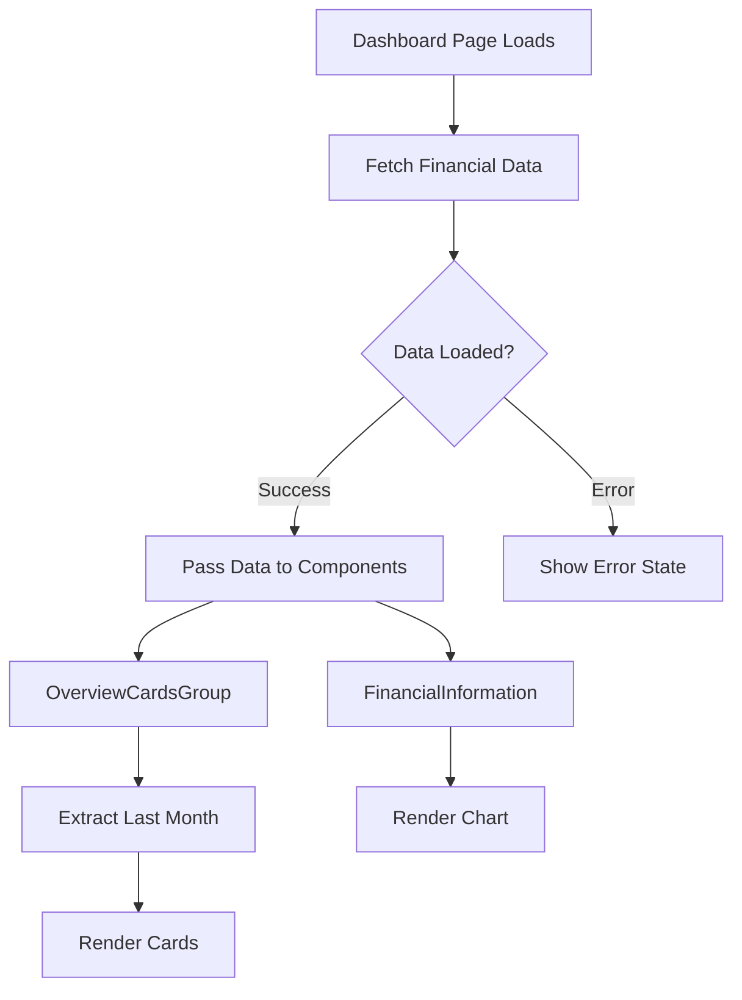

# Design Document

## Overview

Este diseño implementa un patrón de "single source of truth" para los datos financieros en el dashboard, eliminando peticiones duplicadas y garantizando consistencia entre componentes. La solución utiliza el modelo de Server Components de Next.js para obtener los datos en el servidor y pasarlos a los componentes cliente que los necesitan.

### Key Design Decisions

1. **Server-side Data Fetching**: Mantener el fetching de datos en el servidor (Dashboard Page como Server Component) para aprovechar las ventajas de Next.js App Router
2. **Props Drilling**: Pasar datos a través de props es aceptable dado que solo hay un nivel de profundidad
3. **Data Transformation**: Crear una función utilitaria para extraer el último mes de los datos financieros
4. **Backward Compatibility**: Mantener la estructura de datos existente para minimizar cambios en componentes downstream

## Architecture

### Component Hierarchy

```
Dashboard Page (Server Component)
├── Fetches financial data once
├── Passes data to children
│
├── OverviewCardsGroup (Client Component)
│   ├── Receives full financial data
│   ├── Extracts last month values
│   └── Renders 4 overview cards
│
└── FinancialInformation (Client Component)
    ├── Receives full financial data
    └── Renders chart with all months
```

### Data Flow



## Components and Interfaces

### 1. Dashboard Page Component

**Location**: `src/app/dashboard/page.tsx`

**Type**: Server Component (async)

**Responsibilities**:
- Fetch financial data on server-side
- Handle loading and error states
- Pass data to child components

**Changes**:
```typescript
// Add financial data fetching
const financialData = await getFinancialInformationData();

// Pass data to components
<OverviewCardsGroup financialData={financialData} />
<FinancialInformation data={financialData} ... />
```

### 2. OverviewCardsGroup Component

**Location**: `src/app/dashboard/_components/overview-cards/index.tsx`

**Type**: Client Component (needs to be converted from Server Component)

**Props Interface**:
```typescript
type OverviewCardsGroupProps = {
  financialData: FinancialData;
};
```

**Responsibilities**:
- Receive financial data as prop
- Extract last month values using utility function
- Calculate growth rates (optional - can be set to 0 initially)
- Render overview cards with extracted data

**Changes**:
- Add "use client" directive
- Remove `getOverviewData()` call
- Add prop to receive financial data
- Use utility function to extract last month values
- Map financial data to card data structure

### 3. FinancialInformation Component

**Location**: `src/components/Charts/financial-information-overview/index.tsx`

**Type**: Client Component (already is)

**Props Interface** (Updated):
```typescript
type PropsType = {
  data: FinancialData;  // Changed from optional internal fetch
  timeFrame?: string;
  className?: string;
};
```

**Responsibilities**:
- Receive financial data as prop
- Render chart with provided data
- Maintain existing visualization logic

**Changes**:
- Remove internal `useEffect` and `useState` for data fetching
- Remove loading state (handled by parent)
- Accept data as required prop
- Keep all visualization logic unchanged

## Data Models

### FinancialData Type

**Location**: `src/types/charts.types.ts`

**Current Structure** (No changes needed):
```typescript
export type ChartDataPoint = {
  x: string | number;
  y: number;
};

export type FinancialData = {
  gross: ChartDataPoint[];
  taxes: ChartDataPoint[];
  frsh: ChartDataPoint[];
  disc: ChartDataPoint[];
};
```

### OverviewCardData Type

**Location**: `src/app/dashboard/_components/overview-cards/index.tsx` (new type)

**Structure**:
```typescript
type OverviewCardData = {
  value: number;
  growthRate: number;
};
```

### Utility Function Return Type

**Location**: `src/lib/financial-data-utils.ts` (new file)

**Structure**:
```typescript
type LastMonthFinancialData = {
  gross: number;
  taxes: number;
  frsh: number;
  disc: number;
};
```

## Error Handling

### Error Scenarios and Solutions

1. **API Request Fails**
   - **Detection**: Try-catch block in Dashboard Page
   - **Handling**: Show error boundary or error message
   - **User Action**: Provide retry mechanism or show fallback UI

2. **Empty Data Response**
   - **Detection**: Check if data arrays are empty
   - **Handling**: Show "No data available" message
   - **User Action**: Display empty state with helpful message

3. **Invalid Data Structure**
   - **Detection**: Validate data structure after fetch
   - **Handling**: Log error and show fallback UI
   - **User Action**: Show error message to user

4. **Missing Last Month Data**
   - **Detection**: Check if arrays have at least one element
   - **Handling**: Use fallback values (0) or show message
   - **User Action**: Display cards with zero values or hide them

### Error Handling Implementation

```typescript
// In Dashboard Page
try {
  const financialData = await getFinancialInformationData();
  
  // Validate data
  if (!financialData || !isValidFinancialData(financialData)) {
    throw new Error('Invalid financial data structure');
  }
  
  // Render components with data
} catch (error) {
  console.error('Failed to load financial data:', error);
  // Show error UI
  return <ErrorFallback onRetry={() => router.refresh()} />;
}
```

## Testing Strategy

### Unit Tests

1. **Utility Function Tests** (`src/lib/financial-data-utils.test.ts`)
   - Test extraction of last month values
   - Test with empty arrays
   - Test with single data point
   - Test with multiple data points
   - Test with invalid data structures

2. **Component Tests**
   - **OverviewCardsGroup**: Test rendering with valid data, empty data, and edge cases
   - **FinancialInformation**: Test rendering with provided data prop

### Integration Tests

1. **Dashboard Page Tests**
   - Test successful data fetching and rendering
   - Test error handling
   - Test loading states
   - Test data consistency between components

### Manual Testing Checklist

- [ ] Dashboard loads without errors
- [ ] Only one API call is made for financial data
- [ ] OverviewCardsGroup shows correct last month values
- [ ] FinancialInformation chart displays all months correctly
- [ ] Values in cards match last month in chart
- [ ] Error states display correctly
- [ ] Loading states display correctly
- [ ] Page refresh works correctly

## Implementation Notes

### Phase 1: Create Utility Function
- Create `src/lib/financial-data-utils.ts`
- Implement `extractLastMonthData()` function
- Add validation helpers

### Phase 2: Update FinancialInformation Component
- Remove internal data fetching logic
- Update props to require data
- Remove loading state management
- Test component with mock data

### Phase 3: Update OverviewCardsGroup Component
- Add "use client" directive
- Update to accept financial data prop
- Implement data extraction using utility
- Remove old `getOverviewData()` call
- Map extracted data to card format

### Phase 4: Update Dashboard Page
- Import and call `getFinancialInformationData()`
- Add error handling
- Pass data to both components
- Remove old Suspense boundaries if needed
- Test complete flow

### Phase 5: Cleanup
- Remove unused `getOverviewData()` function from `src/app/dashboard/fetch.ts`
- Update any related types
- Remove unused imports

## Performance Considerations

1. **Reduced Network Requests**: From 2 API calls to 1 (50% reduction)
2. **Server-Side Rendering**: Data fetched on server, reducing client-side work
3. **No State Management Overhead**: Simple props passing, no complex state management needed
4. **Caching**: Next.js automatically caches server-side data fetches

## Security Considerations

1. **Data Validation**: Validate API response structure before using
2. **Error Messages**: Don't expose sensitive error details to users
3. **Type Safety**: Use TypeScript to ensure type correctness throughout the flow

## Future Enhancements

1. **Growth Rate Calculation**: Calculate actual growth rates based on previous month data
2. **Data Caching**: Implement more sophisticated caching strategy
3. **Real-time Updates**: Add polling or WebSocket support for live data
4. **Optimistic Updates**: Show cached data while fetching fresh data
5. **Data Filtering**: Allow users to filter by date range
